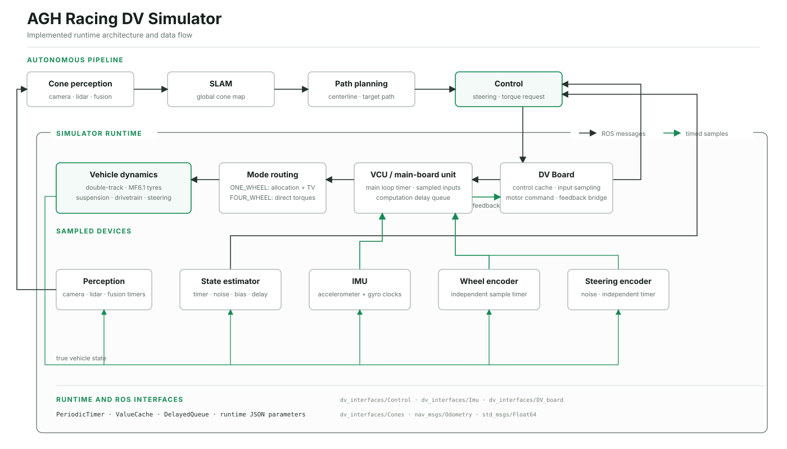

# AGH Racing DV Simulator

Formula Student Driverless vehicle, sensor and perception simulator for ROS 1.
AGH Racing DV Simulator can serve as the vehicle and sensor backend for an
entire autonomous driving pipeline:

```text
cone perception → SLAM → path planning → control → vehicle dynamics
```

The controller is always an external, optional process. The simulator only
exposes the `/dv_board/control` input interface and never starts or depends on
a concrete control package.

## Why this project exists

Driverless software needs repeatable tests before it reaches a real car. AGH
Racing DV Simulator provides a deterministic vehicle environment while
preserving the timing, noise, bias and latency of real embedded systems.

The simulator includes:

- a nonlinear four-wheel double-track vehicle model;
- tyre combined slip, suspension load transfer, drivetrain and aerodynamics;
- independent timers and caches for the DV board, main board and sensors;
- a filtered IMU with separate accelerometer and gyroscope acquisition;
- a state estimator published on `/ins/pose`;
- camera, lidar and fused cone-perception modes;
- optional cone dropout and false-positive detections;
- baseline torque allocation and torque vectoring in `ONE_WHEEL` mode;
- self-contained centerline tracking and vehicle-stability metrics;
- four curated Formula Student event maps.

Vehicle physics, sensor acquisition and ROS orchestration are implemented as
separate modules, keeping each subsystem easy to inspect and configure.

## Architecture



The physics loop uses a configurable step, while each simulated device owns a
`PeriodicTimer`. `ValueCache` models sampled data and `DelayedQueue` models
transport or computation latency. These primitives are isolated in
[`runtime_helpers.hpp`](include/runtime_helpers.hpp), leaving the high-level
sequence readable in [`sim_loop.cpp`](sim_loop.cpp). The model index is in
[`docs/MODELS.md`](docs/MODELS.md), with the complete equation reference in
[`docs/model_equations.tex`](docs/model_equations.tex).

## Models

| Subsystem | Modelled behaviour |
|---|---|
| Vehicle body | planar motion, yaw and four-wheel double-track geometry |
| Tyres | longitudinal/lateral combined slip, load sensitivity and force relaxation |
| Suspension | static, geometric and elastic longitudinal/lateral load transfer |
| Drivetrain | motor lag, torque limits, total power limits and fixed gear ratio |
| Steering | rack dynamics, angle/rate limits, bias and actuator/encoder noise |
| Aerodynamics | velocity-dependent drag and front/rear downforce |
| IMU | independent clocks, analog bandwidth, white noise, bias random walk and output averaging |
| State estimator | delayed noisy pose, velocity, yaw and yaw-rate with bias random walks |
| Perception | camera, lidar or fusion with FOV, range, latency, noise, dropout and false positives |
| Control interface | sampled DV-board input, main-board delay, one-wheel allocation/vectoring or direct four-wheel torques |

Core vehicle equations are implemented in:

- [`double_track.cpp`](src_helpers/double_track.cpp)
- [`tire_model.cpp`](src_helpers/tire_model.cpp)
- [`suspension.cpp`](src_helpers/suspension.cpp)
- [`steering_system.cpp`](src_helpers/steering_system.cpp)
- [`torque_allocation.cpp`](src_helpers/torque_allocation.cpp)

Equations, assumptions and signal definitions are collected in
[`docs/model_equations.pdf`](docs/model_equations.pdf), with the editable
LaTeX source in [`docs/model_equations.tex`](docs/model_equations.tex). The short
[`docs/MODELS.md`](docs/MODELS.md) page provides a model index and compilation
command.

## Requirements

- Ubuntu 20.04
- ROS Noetic
- `catkin_tools`
- Eigen 3
- nlohmann/json

The ROS message definitions used by the simulator are stored in
[`interfaces/dv_interfaces/`](interfaces/dv_interfaces) and generated together
with the project. The repository is a self-contained simulator product with
its complete ROS message interface.

Controller-development (`*_no_pp.launch`) launches run the simulator and
centerline publisher. To drive the car, add a control node that subscribes to
`/dv_board/control`.

Perception-pipeline launches additionally require:

- `dv_slam`
- `dv_path_planning`

## Setup workspace

This repository is a ROS package and must be placed inside the `src` directory
of a catkin workspace. Do not run `catkin build` directly from the repository
directory.

```bash
mkdir -p ~/dv_ws/src
git clone git@github.com:TymekProstak/FS-AGH-Racing-DV-Simulator.git \
  ~/dv_ws/src/FS-AGH-Racing-DV-Simulator
```

It is highly recommended to set up
[GitHub SSH keys](https://docs.github.com/en/authentication/connecting-to-github-with-ssh/generating-a-new-ssh-key-and-adding-it-to-the-ssh-agent)
before cloning through SSH.

If the repository is already cloned elsewhere, link it into the workspace
instead:

```bash
mkdir -p ~/dv_ws/src
ln -s ~/Desktop/FS-AGH-Racing-DV-Simulator \
  ~/dv_ws/src/FS-AGH-Racing-DV-Simulator
```

## Install dependencies

```bash
sudo apt update
sudo apt install python3-catkin-tools libeigen3-dev nlohmann-json3-dev

source /opt/ros/noetic/setup.bash
cd ~/dv_ws
rosdep install --from-paths src --ignore-src -r -y
```

## Build software

```bash
cd ~/dv_ws
source /opt/ros/noetic/setup.bash
catkin init
catkin build

echo "source ~/dv_ws/devel/setup.bash" >> ~/.bashrc
source ~/.bashrc
```

## Quick start

After a successful build, new terminals automatically load the workspace
through `.bashrc`. To load it manually, run:

```bash
source ~/dv_ws/devel/setup.bash
```

Run FSG 2019 with the known-centerline publisher:

```bash
roslaunch lem_simulator fsg_2019_no_pp.launch
```

This standalone mode does not start a controller. The vehicle remains
stationary until another node publishes commands on `/dv_board/control`.

Run the simulator with perception → SLAM → path planning:

```bash
roslaunch lem_simulator fsg_2019.launch
```

This mode requires `dv_slam` and `dv_path_planning` in the same workspace.
Start a controller separately only when closed-loop driving is needed.

Useful RViz data:

- `/viz/cones_gt`
- `/viz/cones_lidar` or `/viz/cones_vis`
- `/viz/bolide_model` — vehicle body and per-wheel normal-load arrows
- `/simulation/gg_sphere`
- TF frames `map`, `bolide_true`, `bolide_CoG`, `base_link`,
  `camera_base`, `os_sensor` and `gps`. The simulator publishes the fixed
  vehicle-to-sensor transforms on `/tf_static`, so
  `dv_bolid_description/description.launch` does not need to be started
  separately.

## Foxglove visualization

The repository includes the
[`sim_simple.json`](foxglove/layouts/sim_simple.json) Foxglove layout with a
3D view, speed gauge and longitudinal/lateral acceleration plots.

Install the ROS 1 Foxglove bridge once:

```bash
sudo apt update
sudo apt install ros-noetic-foxglove-bridge
```

Start the simulator in the first terminal:

```bash
source ~/dv_ws/devel/setup.bash
roslaunch lem_simulator fsg_2019_no_pp.launch
```

Start the bridge in the second terminal:

```bash
source ~/dv_ws/devel/setup.bash
roslaunch --screen foxglove_bridge foxglove_bridge.launch \
  address:=127.0.0.1 port:=8765
```

In Foxglove:

1. Select **Open connection** → **Foxglove WebSocket**.
2. Connect to `ws://localhost:8765`.
3. Open **Layouts** → **Import from file...** and select
   `foxglove/layouts/sim_simple.json` from this repository.

The Foxglove documentation describes the
[ROS 1 connection](https://docs.foxglove.dev/docs/getting-started/frameworks/ros1)
and [layout import](https://docs.foxglove.dev/docs/visualization/layouts)
flows in more detail.

## Events and launch files

Every event has two entry points. Neither one starts a controller:

- `<event>.launch` runs simulator, SLAM and path planning;
- `<event>_no_pp.launch` runs simulator and centerline publisher.

| Event | Perception pipeline | No path planning | Initial pose `(x_m, y_m, yaw_rad)` |
|---|---|---|---|
| Acceleration 150 m | `acc.launch` | `acc_no_pp.launch` | `(0, 0, 0)` |
| Skidpad | `skidpad.launch` | `skidpad_no_pp.launch` | `(0, -15, 1.570796)` |
| FS Czech 2025 | `fs_czech.launch` | `fs_czech_no_pp.launch` | `(1.802392, 23.440755, 0.540726)` |
| FSG 2019 | `fsg_2019.launch` | `fsg_2019_no_pp.launch` | `(0, 0, 0)` |

Each event has a `*_cones.csv` and `*_centerline.csv` file in
[`tracks/`](tracks). The FSG 2019 centerline was digitized from the supplied
reference drawing and smoothed as a closed curve. Its cone boundaries are
generated at a constant 4 m track width, with cones spaced approximately 2 m
along each boundary. Regenerate both files reproducibly with:

```bash
python3 tools/generate_fsg_2019_track.py
```

The reconstructed FSG 2019 track is suitable for software-in-the-loop
development, but it is not a survey-grade reconstruction for official
lap-time comparison.

## Runtime configuration

All model and simulated-device settings are loaded from
[`params_default_lem.json`](config/params_default_lem.json) when the node
starts. Restart the node after changing the file.

All values use SI units except exactly these three user-facing steering
parameters, which are intentionally entered in degrees and converted to
radians once by `ParamBank`:

- `steering_system.steering_bias_deg`
- `steering_system.steering_noise_actuator_std_deg`
- `steering_system.steering_noise_encoder_std_deg`

Important parameters:

| JSON path | Unit | Purpose |
|---|---:|---|
| `simulation.time_step` | s | physics integration and ROS loop period |
| `vehicle.m` | kg | total vehicle mass |
| `vehicle.w` | m | wheelbase |
| `vehicle.aero_package_enabled` | bool | enable drag and downforce |
| `drivetrain.P_max_drive` | W | total drive power limit |
| `drivetrain.P_min_recup` | W | regenerative power limit |
| `main.main_loop_time_step` | s | main-board computation cadence |
| `main.main_computation_delay_s` | s | delayed main-board output |
| `state_estimator.frequency_hz` | Hz | state-estimate acquisition cadence |
| `state_estimator.yaw_noise_std_rad` | rad | yaw white-noise standard deviation |
| `state_estimator.*_bias_rw_*` | SI/√s | state-estimator bias random walks |
| `imu.*_rate_hz` | Hz | accelerometer and gyroscope acquisition clocks |
| `imu.*_bandwidth_hz` | Hz | first-order IMU analog bandwidth |
| `imu.gyroscope_noise_std_rad_per_s` | rad/s | gyroscope white noise |
| `camera.horizontal_fov_rad` | rad | camera horizontal field of view |
| `lidar.azimuth_window_rad` | rad | lidar azimuth region of interest |
| `perception_errors.cone_dropout_probability` | 0–1 | probability of dropping a true detection |
| `perception_errors.false_positive_mean_count` | cones/frame | Poisson mean for synthetic false positives |
| `metrics.sideslip_threshold_rad` | rad | sideslip threshold used by ride metrics |
| `metrics.minimum_speed_mps_for_sideslip` | m/s | ignore undefined low-speed sideslip |
| `torque_allocation_and_vectoring.front_fraction_*` | 0–1 | `ONE_WHEEL` baseline front/rear torque split |
| `torque_allocation_and_vectoring.max_motor_delta_nm` | N·m | `ONE_WHEEL` vectoring clamp per motor side |

Dropout and false positives are independently enabled with
`perception_errors.dropout_enabled` and
`perception_errors.false_positives_enabled`. Their defaults are `false`.

## ROS interface

Input:

| Topic | Type | Meaning |
|---|---|---|
| `/dv_board/control` | `dv_interfaces/Control` | steering and wheel-torque request |

Outputs:

| Topic | Type | Meaning |
|---|---|---|
| `/ins/pose` | `nav_msgs/Odometry` | state estimate |
| `/dv_board/imu` | `dv_interfaces/Imu` | filtered IMU measurement |
| `/dv_board/data` | `dv_interfaces/DV_board` | sampled wheel-speed data |
| `/servo_node/cubemars/encoder_absolute` | `std_msgs/Float64` | noisy steering encoder in rad |
| `/dv_cone_detector/cones` | `dv_interfaces/Cones` | active camera/lidar/fusion perception output |
| `/debug/full_log_info` | `dv_interfaces/full_state` | complete vehicle debug state in SI |

## Metrics

The simulator evaluates the true vehicle pose against the selected event
centerline after every physics step and writes a `*_metrics.csv` file on
shutdown.

Reported values include:

- mean absolute lateral error in m;
- mean absolute heading error in rad;
- mean speed projected onto the centerline in m/s;
- top-10 lateral, heading, sideslip and driven-wheel slip values;
- time and percentage above the configured body-sideslip threshold.

## Repository layout

```text
lem_simulator/
├── config/                    runtime JSON configuration
├── docs/                      model documentation and figures
├── include/                   model and runtime interfaces
├── interfaces/dv_interfaces/  project ROS message definitions
├── launch/                    full-pipeline and no-PP launchers
├── logs/                      generated ride metrics
├── src_helpers/               dynamics, sensor and helper implementations
├── tracks/                    four curated cone maps and centerlines
├── main.cpp                   ROS process and configured physics clock
└── sim_loop.cpp               high-level simulation orchestration
```

## Adding a track

1. Add `tracks/my_event_cones.csv` with columns `x,y,color`.
2. Add `tracks/my_event_centerline.csv` with columns `x,y`.
3. Copy one full and one `_no_pp` launch file.
4. Set `initial_x_m`, `initial_y_m` and `initial_yaw_rad`.
5. Pass the same centerline to `_simulator.launch` for internal metrics.
6. Validate the initial pose before enabling control.

## Validation

```bash
python3 -m json.tool config/params_default_lem.json >/dev/null
for file in launch/*.launch; do xmllint --noout "$file"; done
catkin build lem_simulator --no-deps
```

## License

MIT. See [`LICENSE`](LICENSE).
